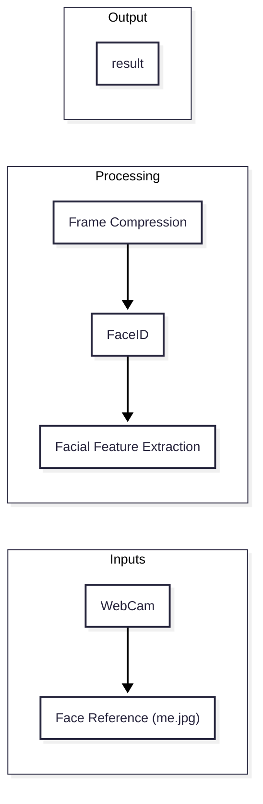

# Design Doc

---
config:
  theme: redux-color
  look: neo
  htmlLabels: true
---

**Author:** Kingsley  
**Status:** Draft / In Review  
**Created:** 2026-09-28  
**Updated:** [Date]  

---

## 1. Overview & Context

### 1.1 Problem Statement (What am I solving?) 
To minimize / eliminate unnecessary friction when working by having a smart, personal AI system
(Like Jarvis, but accessible to everyone and customizable for any user)

### 1.2 Goals
* Everything runs locally on computer (No data sent to external servers)
* Minimize CPU usage to be a minimalistic tool
* Local LLM has limited access and only filters and writes when permitted explicitly by user

### 1.2 Non-Goals (Things to Avoid)
* No manually running raw shell scripts
* Focusing on desktop and CLI applications first for OSX, Linux, and Windows

## 2. Proposed Architecture

### 2.1 *Core Systems*
1. Vision System
  * WebCam captures face (Ignores background, no frames will be saved)
  * Identifies if the person is you (Others have no access unless added)
  * Detects if you are focusing or distracted
2. Local LLM
  * Fetches data from other apps only when permitted(e.g. Gmail, Google Calendar)
  * Email: Filters emergency & non-emergent emails
  * Calendar: Turns events into OS level actions (e.g. Opening apps, websites)

### 2.1.1 Vision System
